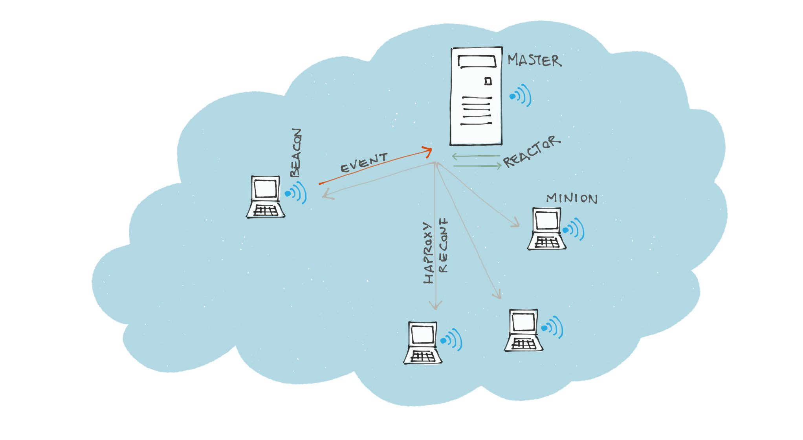

# Service Discovery with SaltStack and HAProxy

**Summary**: a simplified, event-based approach at Service Discovery in a SOA/microservice architecture that attempts to be fully transparent, unobtrusive and light on dependencies.

Inspired by SmartStack[1]. Based on SaltStack and HAProxy.

  

## Introduction
As applications move from monolithic architectures to service-oriented/microservices they face a new problem: how do services map and discover each other? How do these mappings dynamically update in response to failures or new deployments?
The solution is not easy as in SOA/microservice architectures the number of endpoints is non-trivial and they are also naturally expected to dynamically grow/shrink in the lifecycle of the application.

This solution attempts to replicate on each node of the application the experience of the development environment: services started by the developer bind on a specific port on localhost. The port must be different for each service so that they can all be started together. Note that even for those services that might be routed by a front-end proxy depending on url or headers, it is still true that each backend must listen on a different port.

An example: suppose we have a microservice built on the *Seneca* framework, like the example on the Senecajs frontpage. The microservice server by default starts on port XYWZ and the client will attempt by default to consume the service on the same port on localhost. No special configuration is needed. In case there is another Seneca-based service it should set the listening port to a different one and the client should consume from that port accordingly.

In the production environment, server and client will be running on different hosts/containers which means that binding to localhost will not work. They must find a way to discover each other. The solution I propose will replicate that exact convention also in production so that no extra configuration is needed on the developer/application part. In fact the developer and the application should assume that all endpoints (including databases, caches and queues) are available on localhost.

It is the responsibility of the solution to maintain this mapping and to update it when it changes.

The only responsibility of the developers is to pick unique ports for each (micro)service and share the mappings with ops. As explained earlier this also applies to databases, caches, etc so in the case that the application requires more than on Postgres databases they would have to use different ports, i.e: 5432 for the first, 5433 for the second and so on.

## Architecture

The solution requires just two components to operate: [SaltStack](https://github.com/saltstack/salt)
and [HAProxy](http://www.haproxy.org).

HAProxy is loaded and running on each node of the application and transparently routes requests from the frontend port on localhost to one of the backend servers configured for it. HAProxy performs load balancing and health checks, but can be configured not to do either or both. The HAProxy configuration can be tailored to the specific needs of each port by using the powerful template engines supported by SaltStack.

SaltStack’s responsibility is detecting when the network map changes, either because a new service appears or the membership changes (nodes are added or removed). In response to these events it will push a configuration change to all nodes to reflect the new topology. The frequency of the checks is configurable (initially set to check every 30s). Since the checks are run independently on each node (or minion as SaltStack calls them) and the checks only report to the master in case of changes, the network activity is, in conditions of stability, very little to nonexistent.

When a check reports a change the Salt master immediately initiates the configuration change. Currently there is a beta module available  capable of performing rate-limiting so as to avoid ‘configuration storms’.

The network topology is gathered for all nodes by the Salt master using the Mine functionality and is then used to generate a new configuration for each HAProxy instance. The HAProxy service is restarted only if the configuration has changed.

A temporary failure of a service endpoint will be handled by HAProxy, and only if it passes the 30s thresholds it would be detected by the Salt master and acted upon. This allows a sufficient buffer so that service congestions, restarts or upgrades do not trigger a configuration change. Additionally, if deployments are also handled by Salt the checks will be suspended for the duration of the deployment (highstate).

A temporary failure of the Salt master will not block the application simply because each HAProxy instance is perfectly capable of handling the current situation. While the Salt master is unavailable the only events that the solution would not be capable of handling are new nodes or services being deployed. Service failures will still be handled by each HAProxy instance individually.
After the Salt master has been brought back online a configuration refresh can be manually forced by running the same orchestration used by the solution.

The failure of a single node during the reconfiguration phase can be handled in many different ways, depending on the application needs and operating mode:
1. by stopping the configuration change until the node is fixed or removed
2. by continuing anyway, but the node will not receive any requests until it is back online and a new configuration refresh request is received by the master
3. by performing additional checks like a ping or a recovery attempt and then acting on the outcome

## Critique of the solution

The solution inherits the scalability limits of Saltstack[2]. According to experiences learned on various publicly available SaltStack support channels, on very large deployments the CPU power spent by the master coordinating nodes and especially performing encryption is not trivial and might cause the occasional timeout, thus failing a configuration refresh and perhaps an application failure. Fortunately the situation is rapidly improving[3][4] on this front so the limit will be hopefully raised up to the point it will not be an issue for most deployments. The performance tuning guide for Saltstack can be used as reference for such environments[2].
Optionally the solution can be modified to make use of an external returner thus freeing the Salt master from some of the work.

When a service is deployed on an existing node the local port might need to be freed by HAProxy to allow the service to bind to it. This can be achieved as a simple one-line run time instruction to HAProxy that can be added to the service start script or deployment module.

In the case of a hung service with a client running on the same host, the client will fail as there is no HAProxy load balancing for fully local (client and server that are both on the same host) requests. However, hung services can be detected and healed by means of SaltStack automation features.
If the service stops altogether the solution will detect and fix the problem by spawning a new HAProxy frontend to replace the failed service.

## Advantages of the solution

For those already using or considering Saltstack the requirements are trivial and anyway much lower than any other comparable solution. Smartstack for instance requires a Zookeeper instance (3 nodes) and 2 services in addition to HAProxy on each node. Also the services are continuously polling Zookeeper for changes.

Compact: at a few hundreds LOC (python) it is so self-contained that most teams will be able to ‘learn it’ in just a few days. Evaluation should take 1-2 day.

A simpler stack: less software to manage means less chances for things to break. In this case just two are needed: SaltStack and HAProxy.

Service discovery is fully automated and requires little to no configuration. The solution simply scans for open ports on the node and when it finds a new one open in the 3000-10000 range it will treat it as a new service and request a configuration refresh. The solution also handles out-of-the-box some well-known ports like redis, postgres, mysql and rabbitmq in tcp mode, leaving all others in http mode. Adding other ports is as simple as writing a few lines of python.

The same configuration used on the developer machine (everything on localhost) can be used for production, simplifying everything: from delivery to testing and configuration.

Thanks to its event-based architecture, the solution will use no network bandwidth in stable conditions (except for the bandwidth required by the keeping of the Salt minion connection to the master).

## Other features

Configuration storms: the solution implements an experimental rate-limiting state (which will be likely contributed back to SaltStack as a state) to limit the number of configuration refreshes the nodes can request in given time frame. This is useful in case many nodes are deployed/undeployed at once or immediately after the system has been brought online.

Panic mode: the solution comes with a big-red-button(tm) that can be used to enter panic mode in which no more configuration refreshes will be allowed. This can be useful in conditions when a service or a part of the infrastructure is flapping.

Maintenance mode: in maintenance mode a node or any set of nodes as targeted by SaltStack is removed from all HAProxy configurations.

Inspection mode: a node will stop processing configuration refreshes allowing inspection of its status.

### Activity tracker
The project is tracked with a public Trello board:

https://trello.com/b/9SLkJGSN/saltstack-service-discovery

### POC Source:
https://github.com/unicolet/sd

### References
[1] http://nerds.airbnb.com/smartstack-service-discovery-cloud/

[2] https://docs.saltstack.com/en/latest/topics/tutorials/intro_scale.html

[3] https://github.com/saltstack/salt/issues/19926

[4] https://github.com/saltstack/salt/pull/19323
